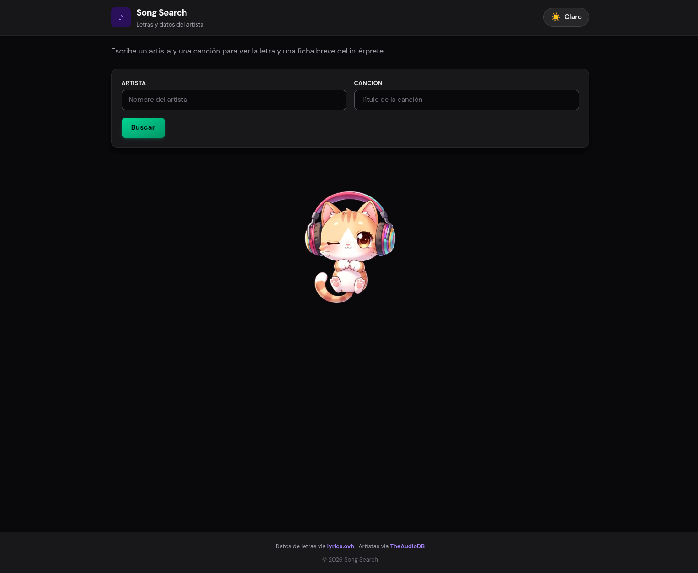
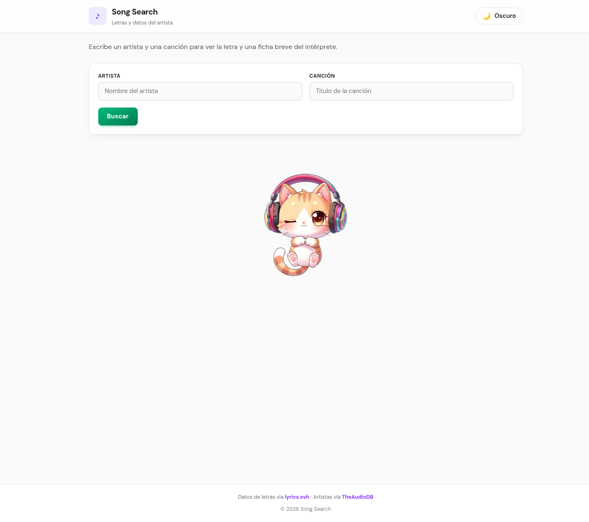
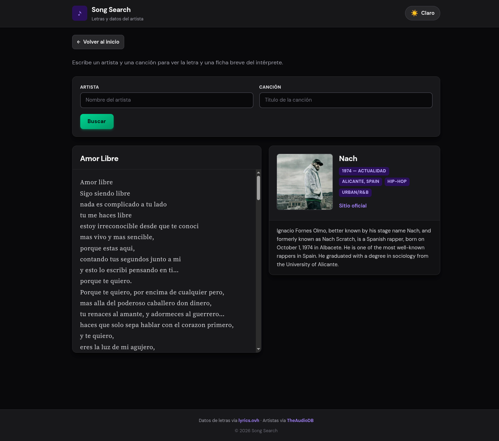

# Song Search

Mini práctica en **React** para buscar letras de canciones y ver una ficha breve del artista. No es un producto en producción: sirve para practicar estado, efectos, formularios y estilos.

## Vista general

Interfaz en modo claro, con el formulario y la imagen decorativa en la página de inicio.



Mismo flujo en **modo oscuro** (tema conmutado desde la cabecera).



Tras enviar la búsqueda se muestran la letra y los datos del intérprete (cuando las APIs responden con datos válidos).



En inicio, antes de buscar, aparece un gato centrado como detalle visual; al buscar desaparece hasta que vuelvas con «Volver al inicio».


## Stack

- [React](https://react.dev/) 19  
- [Vite](https://vite.dev/) 8  
- [Tailwind CSS](https://tailwindcss.com/) 4  

## APIs (solo lectura)

- Letras: [lyrics.ovh](https://api.lyrics.ovh)  
- Artista / biografía: [TheAudioDB](https://www.theaudiodb.com/)  

## Cómo ejecutarlo

```bash
npm install
npm run dev
```

Otros scripts: `npm run build`, `npm run preview`, `npm run lint`.

## Licencia

Proyecto de práctica personal; revisa las condiciones de uso de las APIs enlazadas arriba si reutilizas el código.
